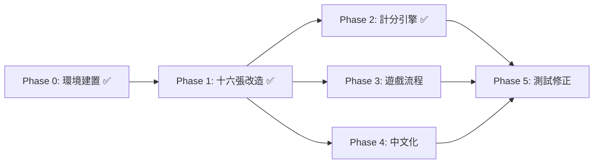

# 開發進程規劃 (DEVPLAN)

## 總覽

```
Phase 0  環境建置          ██████████  ✅ 完成
Phase 1  十六張基礎改造    ██████████  ✅ 完成
Phase 2  台灣計分引擎      ██████████  ✅ 完成
Phase 3  遊戲流程規則      ░░░░░░░░░░  待開發
Phase 4  UI 繁體中文化     ░░░░░░░░░░  待開發
Phase 5  測試 & 修正       ░░░░░░░░░░  待開發
```

---

## Phase 0：環境建置 ✅

**目標：** 把 Pomax/mahjong fork 下來，確認能跑，建立開發環境。

- [x] Fork Pomax/mahjong 到專案目錄
- [x] 確認 `index.html` 能正常在瀏覽器開啟遊戲
- [x] 閱讀核心原始碼，標記需要改動的檔案
- [x] 建立改動點清單文件 (CHANGELIST.md)
- [x] Git init + first commit

**產出：** 可運行的原版遊戲 + 改動點清單

---

## Phase 1：十六張基礎改造 ✅

**目標：** 把遊戲從 13 張制改為 16 張制。

### 實際改動

- [x] `config.js` — 新增 `HAND_TILE_COUNT=16`、`REQUIRED_SETS=5` 常數
- [x] `game.js` — `dealTiles`: `wall.get(13)` → `wall.get(HAND_TILE_COUNT)`
- [x] `pattern.js` — `recurse`/`runExpand`: `sets.length===4` → `===REQUIRED_SETS`
- [x] `tiles-needed.js` — `getStillNeeded`: `scount=4` → `scount=REQUIRED_SETS`
- [x] 瀏覽器驗證：16 張發牌 ✅、摸牌後 17 張 ✅、剩餘牌數合理 ✅
- [x] Git commit: `b02ef12`

**備註：** AI、吃/碰/槓/胡邏輯原版已完整實作，無需額外修改。

---

## Phase 2：台灣計分引擎 ✅

**目標：** 新增 `taiwan-classical.js` 規則檔，實作底+台制計分。

### 實際改動

- [x] **新建 `taiwan-classical.js`** (280+ 行) — `TaiwanClassical extends Ruleset`
  - 底+台制計分：`BASE_SCORE(300) + TAI_SCORE(20) × 台數`
  - 30+ 台數規則：
    - 基本：自摸(1)、門清(1)、門清自摸(3)、莊家(1)
    - 牌型：平胡(2)、碰碰胡(4)、全求人(2)
    - 花色：混一色(4)、清一色(8)、字一色(16)
    - 三元：三元牌刻子(各1)、小三元(4)、大三元(8)
    - 四喜：門風刻(1)、圈風刻(1)、小四喜(4)、大四喜(8)
    - 槓：明槓(1)、暗槓(2)
    - 暗刻：三暗刻(2)、四暗刻(5)、五暗刻(8)
    - 特殊：搶槓(1)、海底撈月(1)、河底撈魚(1)
    - 花牌：每張(1)、花槓(+2)、八仙過海(8)
  - Override `settleScores`: 自摸三家付 / 放槍一家付
  - Override `checkForLimit`: 十三么/九蓮寶燈不適用 16 張
- [x] **`ruleset.js`** — 新增 `Ruleset.TAIWAN_BASE_TAI` scoretype symbol
- [x] **`config.js`** — 匯入 taiwan-classical、預設 `Taiwan Classical`、新增 `BASE_SCORE`/`TAI_SCORE`
- [x] **`chinese-classical.js`** — `concealedCount===5` → `REQUIRED_SETS+1`
- [x] **`cantonese.js`** — 同上
- [x] 瀏覽器驗證：9 台 = 480 分 ✅、自摸三家付 ✅
- [x] Git commit: `141fb07`

---

## Phase 3：遊戲流程規則

**目標：** 實作台灣特有的遊戲流程控制。

### 3.1 莊家系統

- [ ] 連莊判定（莊家胡 → 連莊）
- [ ] 過莊判定（莊家沒胡 → 過莊）
- [ ] 流局連莊判定（莊家有聽 → 連莊）
- [ ] 連莊計數器 & 拉莊加台

### 3.2 圈風系統

- [ ] 圈風追蹤（東南西北圈）
- [ ] 遊戲長度控制（東風戰 / 東南 / 全場）
- [ ] 遊戲結束判定

### 3.3 一炮多響

- [ ] 修改 `getAllClaims` — 允許多家同時宣告胡
- [ ] 多家胡牌的結算（放炮者分別賠付每家）
- [ ] UI 顯示多家同時胡的結算

### 3.4 流局

- [ ] 荒牌流局處理
- [ ] 流局時聽牌檢查（決定是否連莊）

**驗證：** 模擬連莊、過莊、一炮多響場景，確認流程正確。

---

## Phase 4：UI 繁體中文化

**目標：** 把所有英文 UI 換成繁體中文。

### 4.1 文字翻譯

- [ ] 選單 & 設定頁面中文化
- [ ] 遊戲中提示文字（輪到你、吃、碰、槓、胡、過）
- [ ] 牌名顯示中文化
- [ ] 計分結算畫面中文化

### 4.2 新增 UI 元素

- [ ] 顯示當前圈風 / 門風
- [ ] 顯示連莊次數
- [ ] 胡牌結算明細（台數拆解列表）

### 4.3 設定頁面

- [ ] 新增底 / 台金額設定
- [ ] 新增遊戲長度選擇
- [ ] 預設規則改為台灣規則

**驗證：** 所有 UI 無英文殘留，結算畫面資訊完整。

---

## Phase 5：測試 & 修正

**目標：** 全面測試，修復 bug。

### 5.1 自動測試

- [ ] 胡牌判定 unit test（16 張各種牌型）
- [ ] 台數計算 unit test（每種台的組合）
- [ ] 利用 `play-game` 批量跑 AI 對局，檢查 crash

### 5.2 手動測試

- [ ] 完整打 10+ 局，體驗流程
- [ ] 測試邊界情況：天胡、一炮多響、連莊多次、荒牌流局
- [ ] 檢查 UI 顯示是否正確

### 5.3 修正 & 打磨

- [ ] 修復測試中發現的 bug
- [ ] 調整 AI 在 16 張下的表現
- [ ] 優化結算畫面可讀性

**產出：** 可穩定遊玩的台灣十六張麻將遊戲 🎉

---

## 開發依賴關係



- Phase 2 和 Phase 3 可以**並行開發**，都依賴 Phase 1 完成
- Phase 4 主要是文字替換，隨時可以穿插做
- Phase 5 在其他都完成後統一測試
