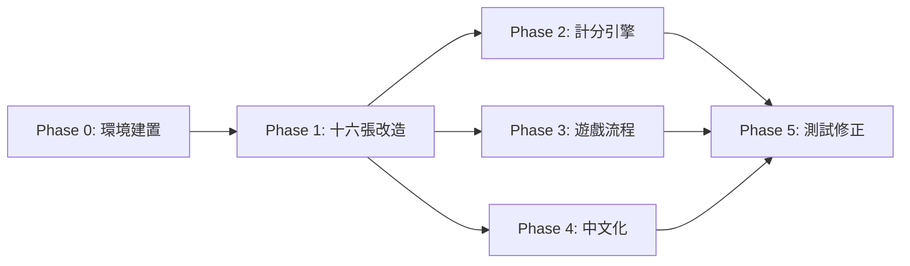

# 開發進程規劃 (DEVPLAN)

## 總覽

```
Phase 0  環境建置          ██░░░░░░░░  預計 0.5 天
Phase 1  十六張基礎改造    ████░░░░░░  預計 2-3 天
Phase 2  台灣計分引擎      ████░░░░░░  預計 2-3 天
Phase 3  遊戲流程規則      ███░░░░░░░  預計 1-2 天
Phase 4  UI 繁體中文化     ██░░░░░░░░  預計 1 天
Phase 5  測試 & 修正       ███░░░░░░░  預計 1-2 天
                                       ─────────
                                       總計 7-12 天
```

---

## Phase 0：環境建置

**目標：** 把 Pomax/mahjong fork 下來，確認能跑，建立開發環境。

- [ ] Fork Pomax/mahjong 到專案目錄
- [ ] 確認 `index.html` 能正常在瀏覽器開啟遊戲
- [ ] 確認 node test 能跑（`node src/js/test/play-game`）
- [ ] 閱讀核心原始碼，標記需要改動的檔案

**產出：** 可運行的原版遊戲 + 改動點清單

---

## Phase 1：十六張基礎改造

**目標：** 把遊戲從 13 張制改為 16 張制，這是最底層的改動。

### 1.1 發牌系統

- [ ] 修改 `dealTiles` — 每人發 16 張，莊家 17 張
- [ ] 調整牌牆計算（144 張 - 花牌後，每人 16 張的分配）
- [ ] 確認補花流程在 16 張下正常運作

### 1.2 手牌管理

- [ ] 修改手牌上限常數 (13 → 16)
- [ ] 調整 UI 手牌排列（16 張的顯示空間）
- [ ] 修改摸牌/打牌邏輯的手牌數量檢查

### 1.3 胡牌判定

- [ ] 修改 `tiles-needed.js` — 從「4 面子 + 1 雀頭」改為「5 面子 + 1 雀頭」
- [ ] 調整胡牌的牌型拆解演算法
- [ ] 把聽牌判定也改為 16 張制

### 1.4 AI 調整

- [ ] AI 摸打邏輯適配 16 張手牌
- [ ] AI 聽牌判斷更新
- [ ] 確認 AI 的吃碰槓決策在新張數下合理

**驗證：** 能完整打完一局 16 張遊戲，不 crash，胡牌判定正確。

---

## Phase 2：台灣計分引擎

**目標：** 新增 `taiwanese.js` 規則檔，實作台數制計分。

### 2.1 建立規則類別

- [ ] 建立 `src/js/core/scoring/taiwanese.js`
- [ ] `TaiwaneseClassical extends Ruleset`
- [ ] 設定基礎參數：底、台金額、計分模式

### 2.2 基本台數

- [ ] 自摸（1 台）
- [ ] 門清（1 台）
- [ ] 門清自摸（3 台，取代上面兩項）
- [ ] 平胡（2 台）
- [ ] 碰碰胡（4 台）
- [ ] 全求人（2 台）
- [ ] 混一色（4 台）
- [ ] 清一色（8 台）

### 2.3 字牌 & 特殊台

- [ ] 三元牌刻子（每組 1 台）
- [ ] 自風刻子（1 台）
- [ ] 圈風刻子（1 台）
- [ ] 槓上開花（1 台）
- [ ] 搶槓胡（1 台）
- [ ] 海底撈月（1 台）
- [ ] 河底撈魚（1 台）
- [ ] 花牌（每張 1 台 + 正花額外 1 台）
- [ ] 槓台（一槓 1 台、兩槓 2 台）

### 2.4 大牌

- [ ] 小三元（4 台）
- [ ] 大三元（8 台）
- [ ] 小四喜（8 台）
- [ ] 大四喜（16 台）
- [ ] 字一色（16 台）
- [ ] 天胡（16 台）
- [ ] 地胡（16 台）

### 2.5 結算邏輯

- [ ] 實作 `底 + (台 × 每台金額)` 計算
- [ ] 自摸：三家都付
- [ ] 放炮：放炮者獨付
- [ ] 連莊加台計算

**驗證：** 對各種牌型的台數計算寫 unit test，確認每種組合正確。

---

## Phase 3：遊戲流程規則

**目標：** 實作台灣特有的遊戲流程控制。

### 3.1 莊家系統

- [ ] 連莊判定（莊家胡 → 連莊）
- [ ] 過莊判定（莊家沒胡 → 過莊）
- [ ] 流局連莊判定（莊家有聽 → 連莊）
- [ ] 連莊計數器 & 拉莊加台

### 3.2 圈風系統

- [ ] 圈風追蹤（東南西北圈）
- [ ] 遊戲長度控制（東風戰 / 東南 / 全場）
- [ ] 遊戲結束判定

### 3.3 一炮多響

- [ ] 修改 `getAllClaims` — 允許多家同時宣告胡
- [ ] 多家胡牌的結算（放炮者分別賠付每家）
- [ ] UI 顯示多家同時胡的結算

### 3.4 流局

- [ ] 荒牌流局處理
- [ ] 流局時聽牌檢查（決定是否連莊）

**驗證：** 模擬連莊、過莊、一炮多響場景，確認流程正確。

---

## Phase 4：UI 繁體中文化

**目標：** 把所有英文 UI 換成繁體中文。

### 4.1 文字翻譯

- [ ] 選單 & 設定頁面中文化
- [ ] 遊戲中提示文字（輪到你、吃、碰、槓、胡、過）
- [ ] 牌名顯示中文化
- [ ] 計分結算畫面中文化

### 4.2 新增 UI 元素

- [ ] 顯示當前圈風 / 門風
- [ ] 顯示連莊次數
- [ ] 胡牌結算明細（台數拆解列表）

### 4.3 設定頁面

- [ ] 新增底 / 台金額設定
- [ ] 新增遊戲長度選擇
- [ ] 預設規則改為台灣規則

**驗證：** 所有 UI 無英文殘留，結算畫面資訊完整。

---

## Phase 5：測試 & 修正

**目標：** 全面測試，修復 bug。

### 5.1 自動測試

- [ ] 胡牌判定 unit test（16 張各種牌型）
- [ ] 台數計算 unit test（每種台的組合）
- [ ] 利用 `play-game` 批量跑 AI 對局，檢查 crash

### 5.2 手動測試

- [ ] 完整打 10+ 局，體驗流程
- [ ] 測試邊界情況：天胡、一炮多響、連莊多次、荒牌流局
- [ ] 檢查 UI 顯示是否正確

### 5.3 修正 & 打磨

- [ ] 修復測試中發現的 bug
- [ ] 調整 AI 在 16 張下的表現
- [ ] 優化結算畫面可讀性

**產出：** 可穩定遊玩的台灣十六張麻將遊戲 🎉

---

## 開發依賴關係



- Phase 2 和 Phase 3 可以**並行開發**，都依賴 Phase 1 完成
- Phase 4 主要是文字替換，隨時可以穿插做
- Phase 5 在其他都完成後統一測試
